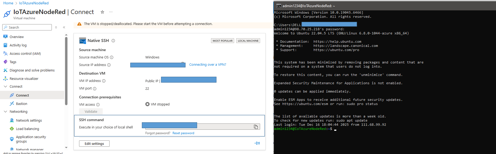
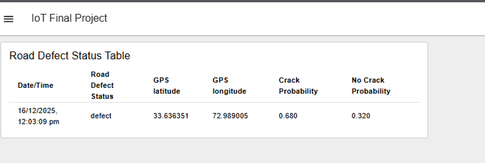
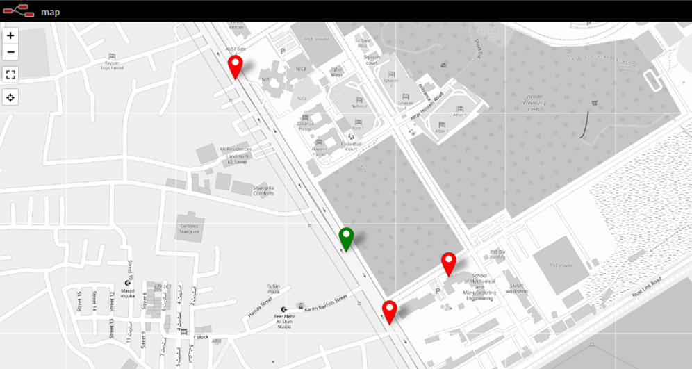

# Road Defect Detection with Edge AI and IoT
### Requirements: 
- Azure Account
- Virtual Machine hosted in Azure (with Ubuntu Image)
- Install Node.js & npm 
- Platform.IO in VSCode

### To upload to ESP32-CAM 
- Load folder (AIthinker) with platform.ini file into VSCode
- Connect board and Press upload 

###  Connecting to Azure VM
- Run your VM
- Connect to your Azure VM instance by typing this in the terminal 
⋅⋅⋅⋅* ssh admin1234@XX.XX.XX.XXX 
- Then enter your password. You should see username@IoTAzureNodeRed
- 

The public IP address can be obtained once you press Connect in the Overview Tab. It will open a tab with the 
exact Public IP address.
- Note: You may have to setup Inbound Port Rules and setup port 1880 so that you can access Node-Red

### Connecting to Node-Red
- Install NodeRed in ubuntu
⋅⋅⋅⋅* sudo npm install -g --unsafe-perm node-red
-Run nodered in terminal by typing
⋅⋅⋅⋅* node-red
- In browser, open http:/XX.XX.XX.XXX:1880/

- For table dashboard
 ⋅⋅⋅⋅* http:/XX.XX.XX.XXX:1880/dashboard/page1

- For map
⋅⋅⋅⋅* http:/XX.XX.XX.XXX:1880/worldmap/

